# Image Downloader Library - Architecture Diagrams

## 1. Work Flow Diagram (Request Flow)

## 2. Thread/Concurrency Diagram

## 3. Component Detail Diagram

## 4. User API - Simple Usage Diagram

```mermaid
graph LR
    User[👤 User Code] --> Manager[ImageDownloaderManager]

    Manager --> Request[requestImage]
    Request --> Callback[Completion Block<br/>image, error, fromCache, fromStorage]

    Manager --> Cache[Cache Control]
    Cache --> ClearCache[clearCache / clearAllCache]
    Cache --> GetCount[Cache Count]

    Manager --> Storage[Storage Control]
    Storage --> ClearStorage[clearStorage]
    Storage --> GetPath[storagePath]

    style User fill:#4169E1,color:#fff
    style Manager fill:#2E8B57,color:#fff
    style Request fill:#FFD700
    style Cache fill:#87CEEB
    style Storage fill:#FFB6C1
```

## 5. Configuration - Simple Setup Diagram

```mermaid
graph LR
    User[👤 User] --> Builder[ConfigBuilder]

    Builder --> Network[Network Config]
    Network --> N1[maxConcurrentDownloads]
    Network --> N2[timeout]
    Network --> N3[retryPolicy]
    Network --> N4[customHeaders]

    Builder --> Cache[Cache Config]
    Cache --> C1[highLatencyLimit]
    Cache --> C2[lowLatencyLimit]

    Builder --> Storage[Storage Config]
    Storage --> S1[enableSaveToStorage]
    Storage --> S2[identifierProvider<br/>MD5/SHA256]
    Storage --> S3[pathProvider<br/>Flat/Hierarchical]
    Storage --> S4[compressionProvider<br/>PNG/JPEG/Adaptive]

    Builder --> Build[build]
    Build --> Config[IDConfiguration]
    Config --> Manager[ImageDownloaderManager.instance]

    style User fill:#4169E1,color:#fff
    style Builder fill:#2E8B57,color:#fff
    style Network fill:#87CEEB
    style Cache fill:#90EE90
    style Storage fill:#FFB6C1
    style Config fill:#FF8C00,color:#fff
    style Manager fill:#DC143C,color:#fff
```

## 6. Quick Start - Three Steps

```mermaid
graph LR
    Step1[1️⃣ Get Manager] --> Step2[2️⃣ Request Image] --> Step3[3️⃣ Display Result]

    Step1 --> S1A[ImageDownloaderManager.shared]
    Step1 --> S1B[ImageDownloaderManager.instance<br/>with custom config]

    Step2 --> S2A[manager.requestImage<br/>url, completion]

    Step3 --> S3A[imageView.image = image]

    style Step1 fill:#4169E1,color:#fff
    style Step2 fill:#2E8B57,color:#fff
    style Step3 fill:#FF8C00,color:#fff
```

## 7. UI Helpers - Easy Integration

```mermaid
graph LR
    User[👤 User] --> UIKit[UIKit]
    User --> SwiftUI[SwiftUI]

    UIKit --> Extension[UIImageView Extension]
    Extension --> E1[setImage with URL]
    Extension --> E2[Placeholder Support]
    Extension --> E3[Auto Cancellation]

    UIKit --> AsyncView[UIAsyncImageView]
    AsyncView --> A1[Custom UIImageView]
    AsyncView --> A2[Progress Tracking]
    AsyncView --> A3[Error Handling]

    SwiftUI --> SUI1[AsyncImageView]
    SUI1 --> S1[Progress Bar]
    SUI1 --> S2[Placeholder/Error Images]
    SUI1 --> S3[Auto Cancel on Disappear]

    SwiftUI --> SUI2[ProgressiveAsyncImage]
    SUI2 --> P1[Progressive Loading]
    SUI2 --> P2[Custom Content Builder]

    UIKit --> Transform[Image Transformations]
    SwiftUI --> Transform
    Transform --> T1[Resize]
    Transform --> T2[Crop]
    Transform --> T3[Circle/RoundedCorners]
    Transform --> T4[Composite Multiple]

    style User fill:#4169E1,color:#fff
    style UIKit fill:#2E8B57,color:#fff
    style SwiftUI fill:#FF8C00,color:#fff
    style Extension fill:#87CEEB
    style AsyncView fill:#90EE90
    style SUI1 fill:#FFB6C1
    style SUI2 fill:#DDA0DD
    style Transform fill:#F0E68C
```

## Key Features Summary

### 1. Three-Layer Architecture
- **Cache Layer**: Two-tier LRU cache (High/Low latency) using Swift Actor for thread safety
- **Storage Layer**: Disk persistence with customizable providers (identifier, path, compression)
- **Network Layer**: Concurrent downloads with retry policy and request deduplication

### 2. Thread Safety
- **Cache**: Swift Actor with automatic serialization
- **Network**: Serial DispatchQueue for state management
- **Manager**: NSLock for caller registry
- **Storage**: Synchronous FileManager operations

### 3. Smart Request Handling
- **Deduplication**: Multiple requests for same URL join single download
- **Caller Registry**: Weak references to avoid retain cycles
- **Priority Queue**: High-priority requests jump ahead
- **Concurrency Limit**: Configurable max simultaneous downloads

### 4. Extensibility
- **Protocol-based Providers**: Custom identifier, path, and compression strategies
- **Configuration Builder**: Fluent API for easy setup
- **Retry Policy**: Pluggable retry strategies
- **UI Extensions**: Ready-to-use SwiftUI and UIKit components

### 5. Performance Optimizations
- **Background Decoding**: Images decoded off main thread
- **LRU Eviction**: Automatic memory management
- **Request Coalescing**: Reduces duplicate network calls
- **Lazy Storage**: Only saves to disk if configured
