# ImageDownloader Library - Complete Sequence Diagram

## Full Request Flow with All Components

```plantuml
@startuml ImageDownloader_Complete_Flow
!theme plain
skinparam backgroundColor #FFFFFF
skinparam defaultFontName Arial
skinparam sequenceMessageAlign center
skinparam BoxPadding 10

title ImageDownloader Library - Complete Request Flow

actor "Caller\n(UIImageView)" as Caller
participant "ImageDownloader\nManager" as Manager
participant "CacheAgent\n(Actor)" as Cache
participant "StorageAgent\n(FileManager)" as Storage
participant "NetworkAgent\n(Serial Queue)" as Network
participant "CallerRegistry\n(NSLock)" as Registry
participant "DownloadTask" as Task
participant "ImageDecoder\n(Background)" as Decoder
participant "URLSession" as Session

== Scenario 1: Cache HIT ==

Caller -> Manager: requestImage(url, caller, completion)
activate Manager

Manager -> Cache: image(for: url)
activate Cache
Cache -> Cache: Check cacheData[urlKey]
Cache --> Manager: .hit(UIImage)
deactivate Cache

Manager -> Manager: mainThreadCompletion on main queue
Manager --> Caller: completion(image, nil, fromCache: true)
deactivate Manager

== Scenario 2: Cache WAIT (Duplicate Request) ==

Caller -> Manager: requestImage(url, caller, completion)
activate Manager

Manager -> Cache: image(for: url)
activate Cache
Cache -> Cache: Check cacheData[urlKey]
note right: Entry exists but .default\n(download in progress)
Cache --> Manager: .wait
deactivate Cache

Manager -> Registry: registerCaller(url, caller, completion)
activate Registry
Registry -> Registry: Create WeakBox(caller)
Registry -> Registry: callerRegistry[urlKey].append(entry)
note right: Lock with NSLock\nStore (WeakBox, completion, progress)
Registry --> Manager: registered
deactivate Registry

note over Manager: Request joined to existing download\nNo new network request made
deactivate Manager

== Scenario 3: Cache MISS -> Storage HIT ==

Caller -> Manager: requestImage(url, caller, completion)
activate Manager

Manager -> Cache: image(for: url)
activate Cache
Cache -> Cache: Check cacheData[urlKey]
Cache -> Cache: cacheData[urlKey] = .default
note right: Mark as WAIT state\nfor future requests
Cache --> Manager: .miss
deactivate Cache

alt shouldSaveToStorage == true
    Manager -> Storage: image(for: url)
    activate Storage
    Storage -> Storage: Read file from disk
    Storage --> Manager: UIImage (from storage)
    deactivate Storage

    Manager -> Cache: setImage(image, isHighLatency)
    activate Cache
    Cache -> Cache: cacheData[urlKey] = CacheEntry(image)
    Cache -> Cache: Update LRU queue
    Cache -> Cache: evictMemory() if needed
    deactivate Cache

    Manager --> Caller: completion(image, nil, fromCache: false, fromStorage: true)
end

deactivate Manager

== Scenario 4: Cache MISS -> Storage MISS -> Network Download ==

Caller -> Manager: requestImage(url, caller, completion)
activate Manager

Manager -> Cache: image(for: url)
activate Cache
Cache -> Cache: cacheData[urlKey] = .default
Cache --> Manager: .miss
deactivate Cache

Manager -> Storage: image(for: url)
activate Storage
Storage -> Storage: Check file exists
Storage --> Manager: nil (not found)
deactivate Storage

Manager -> Network: downloadData(url, priority, progress, completion)
activate Network

Network -> Network: Check on isolationQueue
alt Duplicate Request Detection
    Network -> Network: activeDownloads[urlKey] exists?
    Network -> Task: addWaiter(completion, progress)
    note right: Request deduplication\nJoin existing download
else Concurrency Limit Check
    Network -> Network: activeDownloads.count >= maxConcurrent?
    alt Queue Full
        Network -> Network: Create PendingDownloadRequest
        Network -> Network: Insert into pendingQueue\n(priority-based insertion)
        note right: High priority requests\ninserted before low priority
    else Slot Available
        Network -> Network: startDownloadUnsafe()
        Network -> Task: Create DownloadTask
        activate Task
        Network -> Network: activeDownloads[urlKey] = task

        Network -> Session: dataTask(with: request).resume()
        activate Session

        Session -> Session: URLSessionDataTask
        note right: HTTP download in progress\nProgress callbacks via SessionDelegate

        Session --> Network: data + response
        deactivate Session

        alt Download Success
            Network -> Network: Validate response (200-299)
            Network -> Network: Validate data

            Network -> Decoder: decodeImage(from: data)
            activate Decoder
            note right: Background thread\nUIImage(data: data)
            Decoder --> Network: UIImage
            deactivate Decoder

            Network -> Task: notifyAllWaiters(data, nil)
            Task -> Task: Iterate all waiters

            Task --> Network: completion(UIImage, nil)
            deactivate Task

            Network -> Network: activeDownloads.remove(urlKey)
            Network -> Network: processNextPendingUnsafe()
            note right: Start next pending download\nif queue not empty

            Network --> Manager: completion(UIImage, nil)

        else Download Failure
            alt Retry Policy
                Network -> Network: shouldRetry(error, attempt)
                Network -> Network: delay = retryPolicy.delay(attempt + 1)
                Network -> Network: Retry after exponential backoff
            else No Retry
                Network -> Task: notifyAllWaiters(nil, error)
                Task --> Network: completion(nil, error)
                deactivate Task
                Network --> Manager: completion(nil, error)
            end
        end
    end
end

deactivate Network

alt Success - Process Downloaded Image
    Manager -> Storage: saveImage(image, url)
    activate Storage
    note right: Background thread\nAtomic write operation
    Storage -> Storage: compressionProvider.compress(image)
    Storage -> Storage: write to disk
    Storage --> Manager: success
    deactivate Storage

    Manager -> Cache: setImage(image, isHighLatency)
    activate Cache
    Cache -> Cache: Update cacheData[urlKey]
    Cache -> Cache: Append to LRU queue
    Cache -> Cache: evictMemory() if needed
    deactivate Cache

    Manager -> Manager: notifySuccess(url, image)
    Manager --> Caller: completion(image, nil, false, false)

    Manager -> Registry: notifyCallers(url, image, nil)
    activate Registry
    Registry -> Registry: Get waiters for urlKey
    Registry -> Registry: callerRegistry.removeValue(urlKey)

    loop For each waiter
        Registry -> Registry: Check waiter.caller.value != nil
        alt Caller Still Alive
            Registry -> Caller: DispatchQueue.main.async {\n  completion(image, nil, false, false)\n}
        else Caller Dead
            Registry -> Registry: Skip (WeakBox.value == nil)
        end
    end
    deactivate Registry

else Failure
    Manager -> Manager: notifyFailure(url, error)
    Manager --> Caller: completion(nil, error, false, false)

    Manager -> Registry: notifyCallers(url, nil, error)
    activate Registry
    Registry -> Registry: Notify all waiting callers
    deactivate Registry
end

deactivate Manager

== Background: Periodic Cleanup (Every 30s) ==

Manager -> Manager: Timer fires every 30s
Manager -> Registry: cleanupDeadCallers()
activate Registry

Registry -> Registry: Lock with NSLock
loop For each (urlKey, waiters)
    Registry -> Registry: Filter aliveWaiters\n(waiter.caller.value != nil)
    alt All Waiters Dead
        Registry -> Registry: callerRegistry.removeValue(urlKey)
    else Some Alive
        Registry -> Registry: callerRegistry[urlKey] = aliveWaiters
    end
end
deactivate Registry

@enduml
```

## Key Components Interaction Details

### 1. **ImageDownloaderManager** (Coordinator)
- Entry point for all image requests
- Manages caller registry for request deduplication
- Coordinates between Cache, Storage, and Network agents
- Ensures all callbacks run on main thread
- Periodic cleanup of dead callers (30s timer)

### 2. **CacheAgent** (Swift Actor - Thread Safe)
- Two-tier LRU cache (high/low latency)
- Three states: HIT, WAIT, MISS
- Actor isolation ensures thread-safe access
- Automatic eviction when limits exceeded
- WAIT state prevents duplicate downloads

### 3. **StorageAgent** (Synchronous FileManager)
- Disk persistence with customizable:
  - Identifier Provider (MD5/SHA256)
  - Path Provider (Flat/Hierarchical)
  - Compression Provider (PNG/JPEG/Adaptive)
- All I/O on background threads
- Atomic write operations

### 4. **NetworkAgent** (Serial Queue for Thread Safety)
- **Request Deduplication**: Multiple requests for same URL share one download
- **Concurrency Limiting**: Max simultaneous downloads (default: 6)
- **Priority Queue**: High-priority requests jump ahead in pending queue
- **Retry Policy**: Configurable attempts with exponential backoff
- **Progress Tracking**: Real-time download progress callbacks
- Downloads RAW data only - decoding separate

### 5. **CallerRegistry** (Weak References + NSLock)
- Stores waiting callers for images being downloaded
- Uses WeakBox to avoid retain cycles
- Thread-safe with NSLock
- Periodic cleanup removes dead callers
- Notifies all waiters when download completes

### 6. **ImageDecoder** (Background Decoding)
- Decodes images on background thread
- Prevents main thread blocking
- Returns UIImage ready for display

### 7. **PendingQueue** (Priority FIFO)
- Holds downloads waiting for available slots
- High-priority requests inserted before low-priority
- Processed when active downloads complete
- Prevents memory exhaustion from unlimited concurrent downloads

## Thread Safety Mechanisms

| Component | Mechanism | Purpose |
|-----------|-----------|---------|
| CacheAgent | Swift Actor | Automatic serialization of all cache operations |
| NetworkAgent | Serial DispatchQueue | Thread-safe state management (activeDownloads, pendingQueue) |
| CallerRegistry | NSLock | Protect concurrent access to registry dictionary |
| StorageAgent | Background Queue | All FileManager I/O on background threads |
| Callbacks | DispatchQueue.main | All completion blocks run on main thread |

## Performance Optimizations

1. **Request Deduplication**: Saves 50-90% bandwidth in list/grid views
2. **Concurrency Limiting**: Prevents resource exhaustion
3. **Priority Queue**: Important images load first
4. **Two-Tier Cache**: High-latency for persistent, low-latency for transient
5. **Background Decoding**: Smooth scrolling, no main thread blocking
6. **LRU Eviction**: Automatic memory management
7. **Lazy Storage**: Only saves to disk if configured
8. **Weak References**: Automatic cleanup when views deallocated
9. **Actor-based Cache**: Lock-free concurrent reads

## Error Handling & Edge Cases

1. **Cancelled Requests**: Properly cleaned up, no memory leaks
2. **Dead Callers**: Periodic cleanup every 30s removes WeakBox with nil value
3. **Network Failures**: Retry with exponential backoff (configurable)
4. **Timeout**: Configurable per-request timeout
5. **Invalid Data**: Graceful error handling with typed errors
6. **Background Task**: Downloads continue when app backgrounded (if enabled)
7. **Memory Pressure**: LRU eviction based on configurable limits

## Configuration Points

All configurable via `ConfigBuilder`:

- **Network**: maxConcurrentDownloads, timeout, retryPolicy, customHeaders, authHandler
- **Cache**: highLatencyLimit, lowLatencyLimit
- **Storage**: enableSaveToStorage, identifierProvider, pathProvider, compressionProvider
- **Retry**: maxAttempts, baseDelay, multiplier (exponential backoff)

## Example Flow Summary

**Scenario**: User scrolls list with 100 images, 10 visible

1. **First request**: Cache MISS → Storage MISS → Network download starts
2. **Same URL requested again**: Cache WAIT → Joins existing download (deduplication)
3. **10 concurrent downloads**: Slots 1-6 active, slots 7-10 in pending queue
4. **User scrolls away**: UIImageView deallocated → Weak reference becomes nil → Auto cleanup
5. **Download completes**: All waiters notified → Next pending starts → Cached for future

This architecture provides production-ready image loading with excellent performance, thread safety, and resource management.
