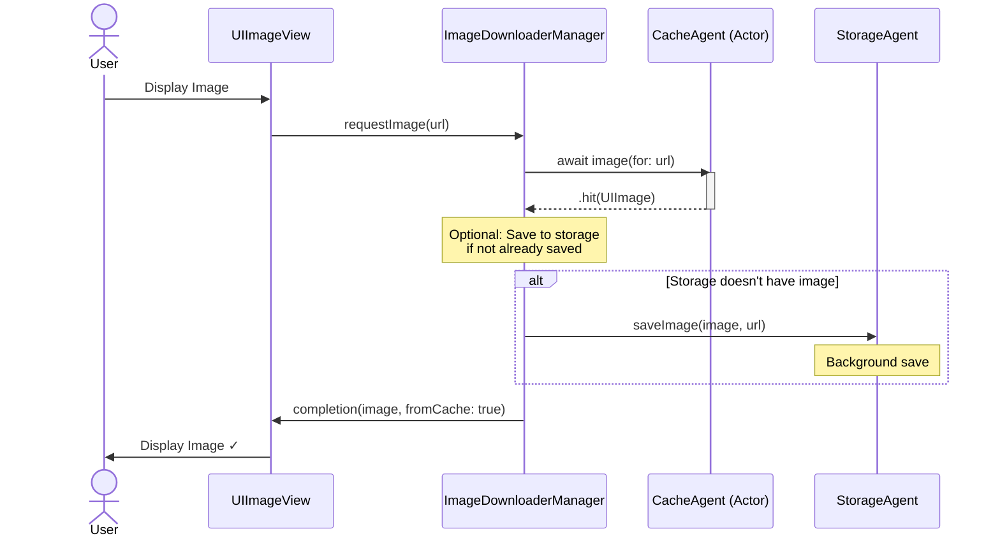
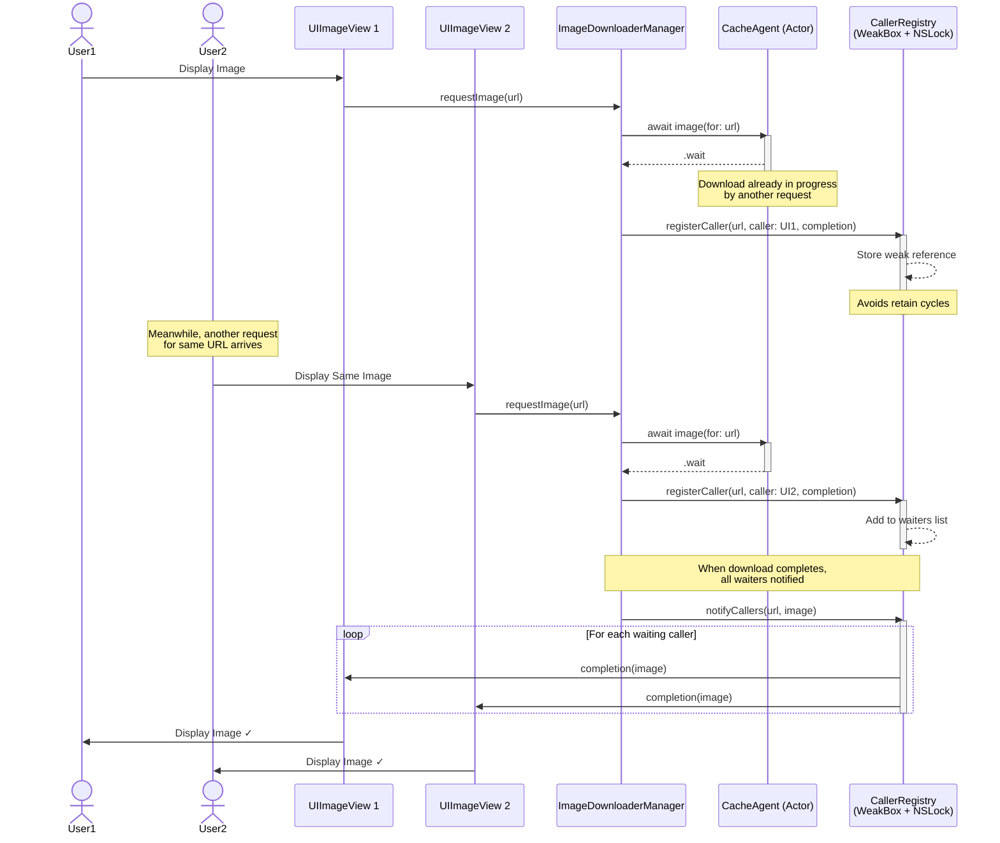
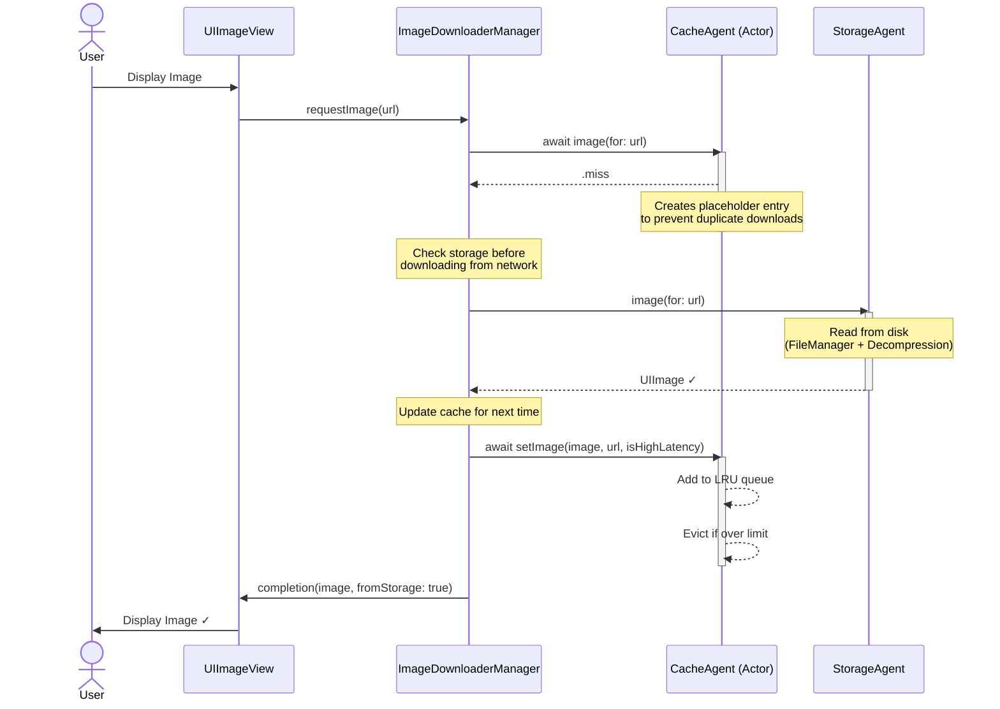
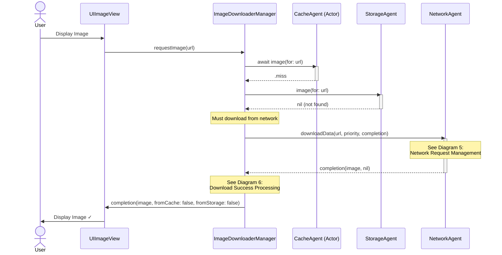
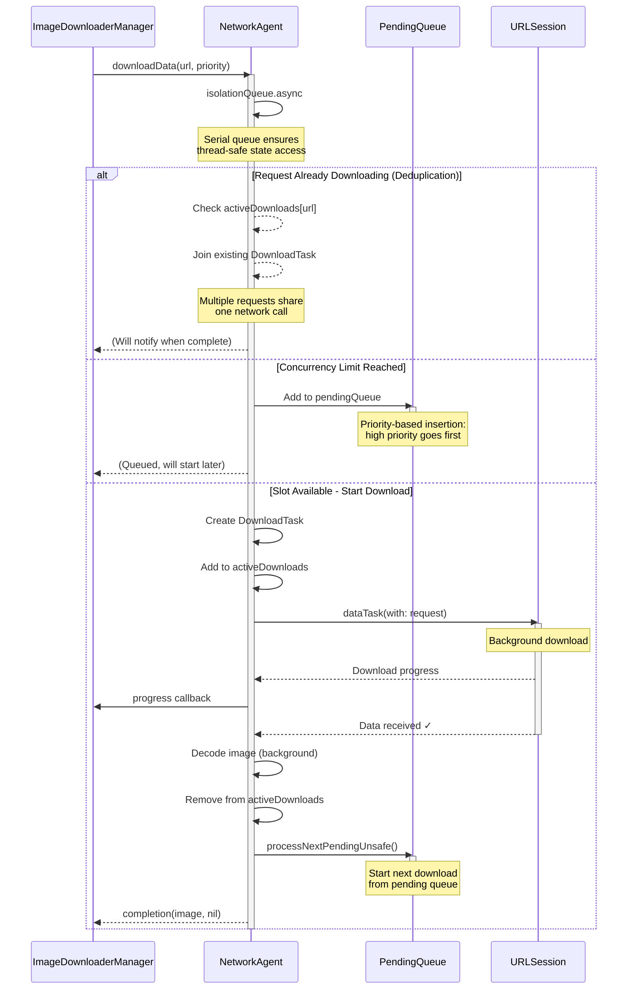
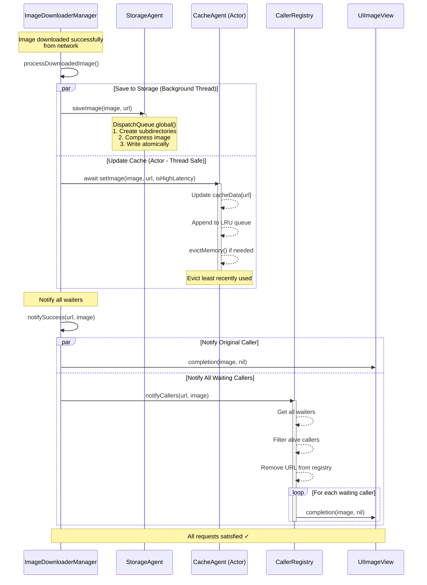
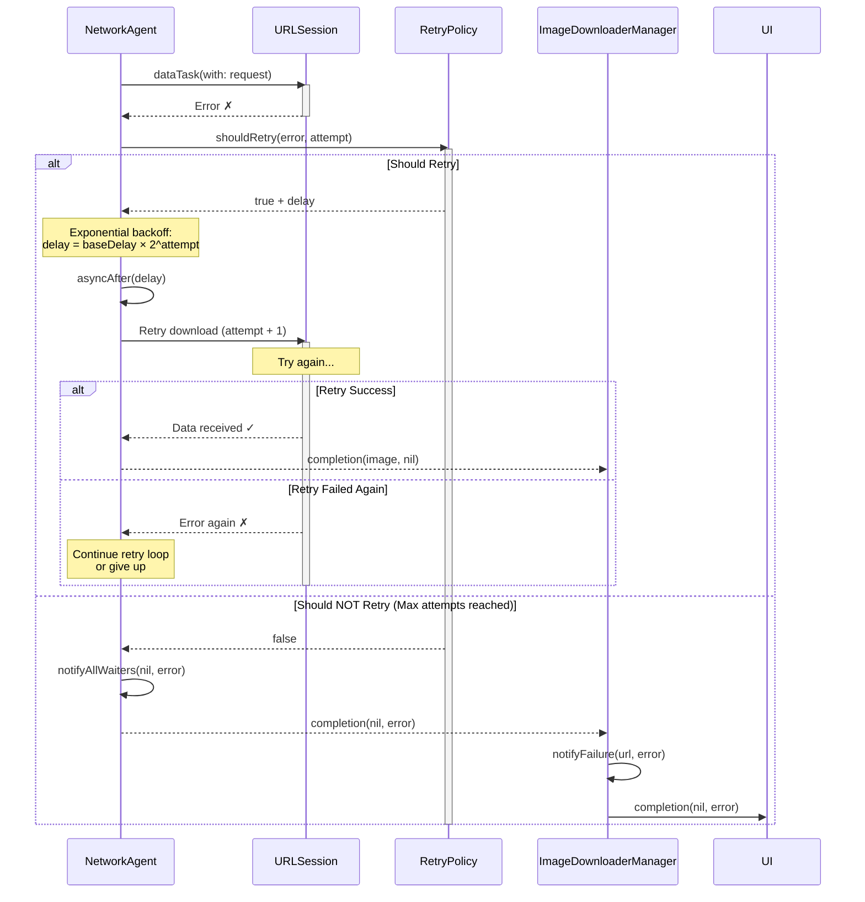

# ImageDownloader Library - Sequence Diagrams (Modular)

## Overview

This document contains the complete flow broken down into 6 smaller, manageable sequence diagrams:

1. **Cache Hit Flow** - Fastest path, image in memory
2. **Cache Wait Flow** - Request deduplication when download in progress
3. **Storage Hit Flow** - Cache miss but image on disk
4. **Network Download Flow** - Full download from network
5. **Network Request Management** - Concurrency control & deduplication
6. **Download Success Processing** - Save to storage and cache

---

## 1. Cache Hit Flow (Simple & Fast)



---

## 2. Cache Wait Flow (Request Deduplication)



---

## 3. Storage Hit Flow (Disk Cache)



---

## 4. Network Download Flow (Full Path)



---

## 5. Network Request Management (Concurrency Control)



---

## 6. Download Success Processing (Save & Cache)



---

## 7. Error Handling & Retry Flow



---

## Flow Decision Tree

```
User requests image
    ↓
Check Cache
    ├─ HIT  → Return immediately ✓ (Diagram 1)
    ├─ WAIT → Join existing download (Diagram 2)
    └─ MISS → Continue
         ↓
    Check Storage
         ├─ HIT  → Load from disk, update cache ✓ (Diagram 3)
         └─ MISS → Continue
              ↓
         Download from Network (Diagram 4)
              ├─ Check concurrency (Diagram 5)
              │    ├─ Already downloading → Join
              │    ├─ Queue full → Add to pending
              │    └─ Slot available → Start download
              │         ↓
              │    Download & Decode
              │         ├─ Success → Process (Diagram 6)
              │         └─ Error → Retry (Diagram 7)
              ↓
         Save to storage + Update cache (Diagram 6)
              ↓
         Notify all waiters ✓
```

---

## Component Responsibilities Summary

| Component | Responsibility | Thread Safety |
|-----------|---------------|---------------|
| **CacheAgent** | Two-tier LRU memory cache | Swift Actor |
| **StorageAgent** | Disk persistence with compression | Background Queue |
| **NetworkAgent** | Download management & concurrency | Serial DispatchQueue |
| **CallerRegistry** | Track waiting callers with weak refs | NSLock |
| **PendingQueue** | Priority-based download queue | Part of NetworkAgent |
| **RetryPolicy** | Retry strategy & backoff | Stateless |

---

## Key Features Highlighted

1. **Request Deduplication** (Diagram 2) - Multiple requests share one download
2. **Concurrency Control** (Diagram 5) - Max simultaneous downloads with priority queue
3. **Three-tier Caching** (Diagrams 1, 3, 4) - Memory → Disk → Network
4. **Weak References** (Diagram 2) - Automatic cleanup when views deallocated
5. **Parallel Processing** (Diagram 6) - Storage save & cache update in parallel
6. **Retry Logic** (Diagram 7) - Exponential backoff for failed downloads

---

## Testing Each Diagram

Each diagram can be tested independently:

- **Diagram 1**: Test with cached images
- **Diagram 2**: Make multiple simultaneous requests for same URL
- **Diagram 3**: Clear cache, keep storage
- **Diagram 4-6**: Clear cache and storage
- **Diagram 7**: Test with invalid URLs or network errors

This modular approach makes debugging and understanding much easier!
